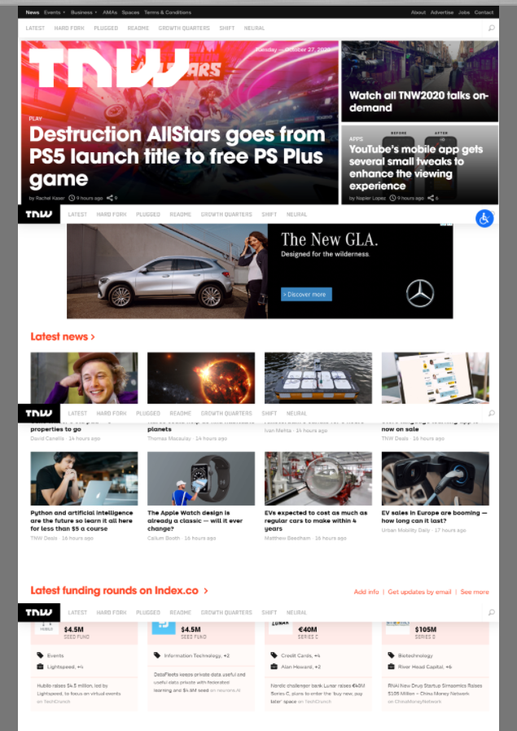

## Week 2

# Project 2 :  Building with Responsive Design

> This Project consists of making a clone of a New York Times article page.

You can find the original project specification at: https://www.theodinproject.com/courses/html5-and-css3/lessons/building-with-responsive-design

## Built With

- HTML
- CSS
- VScode & Atom as code editors

## Live Demo  !NEEDS UPDATE!NEEDS UPDATE

[Live Demo Link](https://od-c0d3r.github.io/exx2/)

## Authors

👤 **Angel Barros**

- GitHub: [@Zappat0n](https://github.com/Zappat0n)
- LinkedIn: [LinkedIn](https://www.linkedin.com/in/angel-luis-barros-pazos-8889011b5/)

👤 **Omar Rashad**

- GitHub: [@od-c0d3r](https://github.com/od-c0d3r)
- Twitter: [@od_coder](https://twitter.com/od_coder)
- LinkedIn: [LinkedIn](https://www.linkedin.com/in/omarrashad/)

## 🤝 Contributing

Contributions, issues, and feature requests are welcome!

## Show your support

Give a ⭐️ if you like this project!
